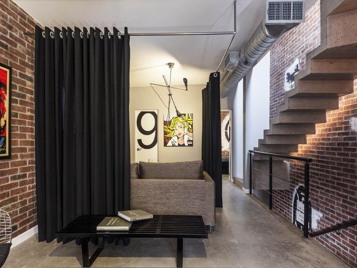

<!DOCTYPE html>
<html lang="pt-BR">
<head>
    <meta charset="UTF-8">
    <title>Bem Bonita Cortinas & Papéis de Parede</title>
    
</head>
<body>
    
  

    

          Bem Bonita Cortinas & Papéis de Parede
    

  

  

    

         MENU </a> 
         
         
        <a href="pagina1.html" target="_blank"> Pagina Inicial </a>
         
         
        <a href="pagina2.html" target="_blank"> Institucional </a>
         
         
        <a href="pagina3.html" target="_blank"> Produtos </a>
         
         
        <a href="pagina4.html" target="_blank"> Novidades </a>
         
         
        <a href="pagina5.html" target="_blank"> Contato </a>
         
         
        <a href="pagina6.html" target="_blank"> Redes Sociais </a>
         
         

  

    
   
   

       

         
         
      Av. São Luiz, qd.07 - lt.21 - St. Santa Rita VII, Goiânia</a> 
  

 

